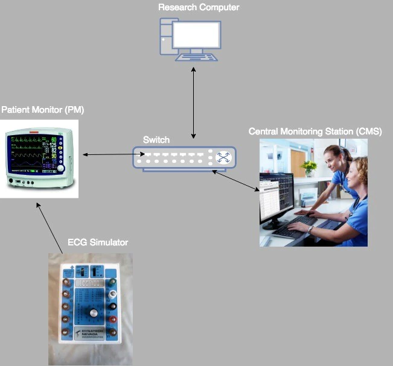
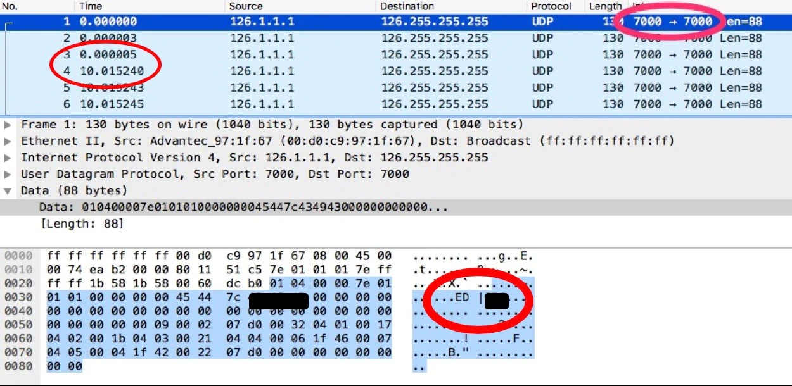
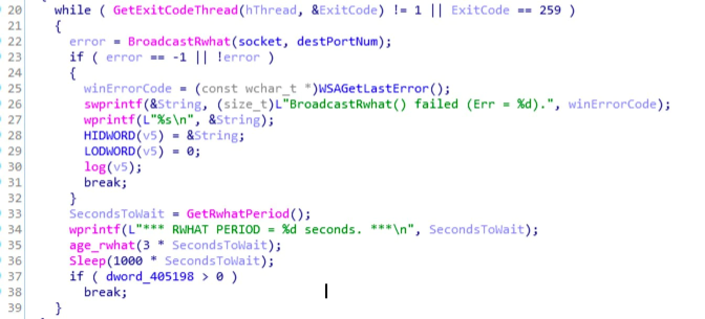
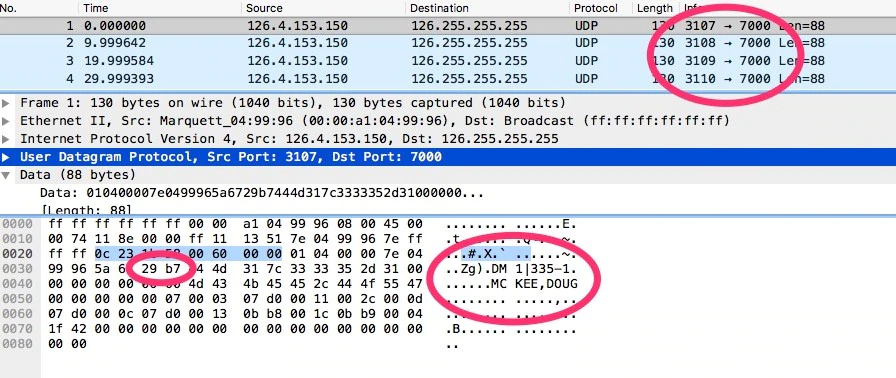
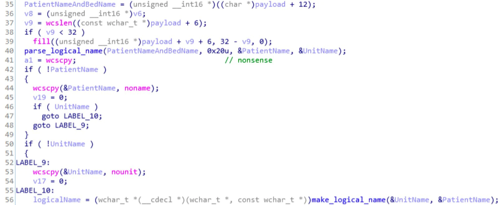
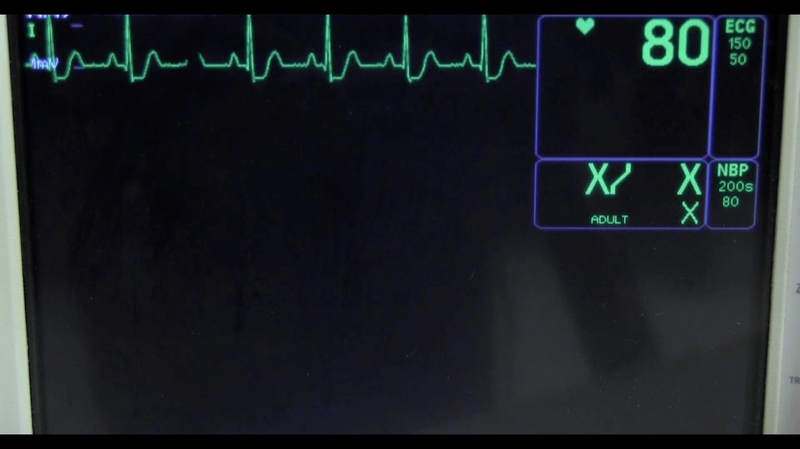
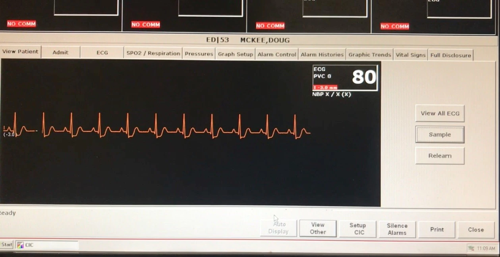
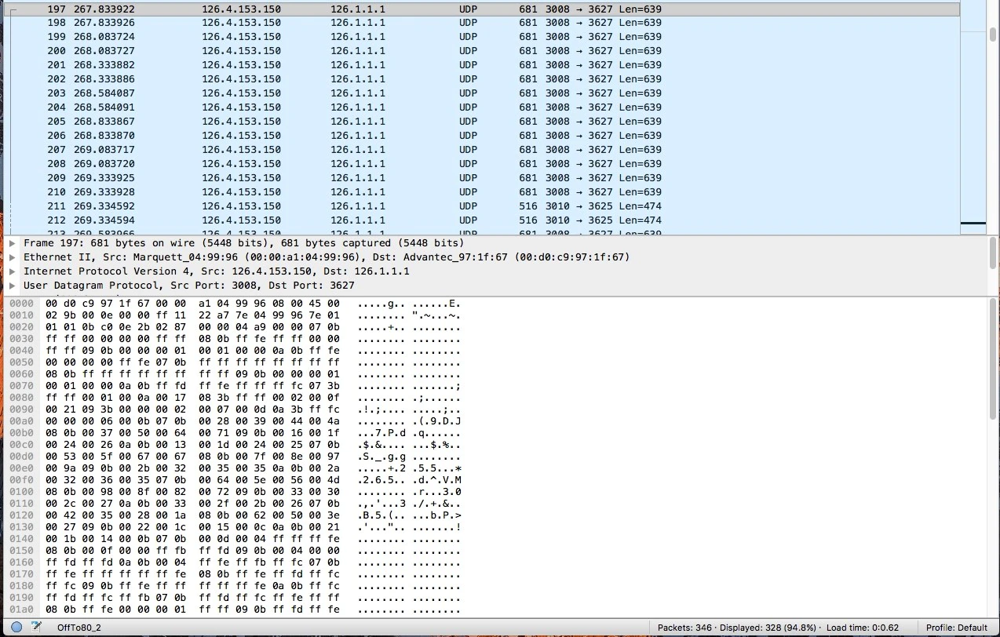
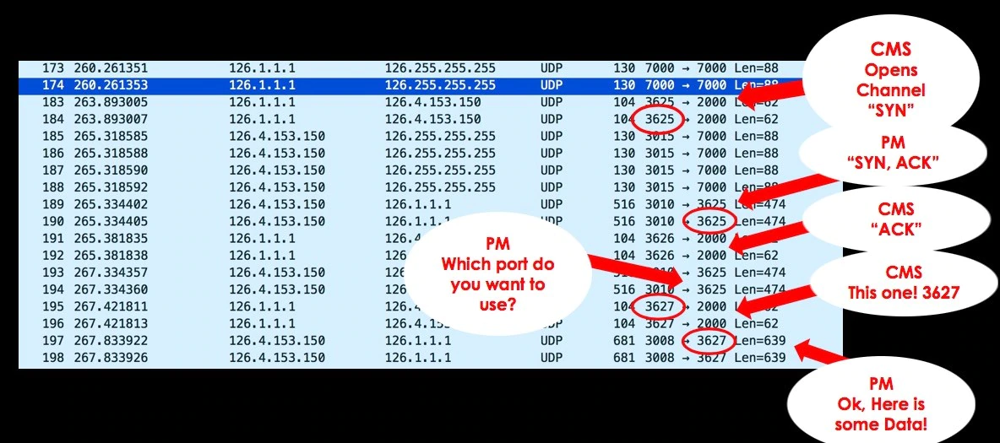

The below is an article written by my colleague, Doug McKee, a senior vulnerability researcher in Advanced Threat Research at McAfee. [Used with permission: Small reformatting changes only -- all words, opinions, and statements belong to the author.]

This is a longer article, but well worth the read! Feel free to take a look at some of his other work, which uses some other network security concepts we have discussed.

---

# 80 to 0 in Under 5 Seconds: Falsifying a Medical Patient's Vitals

By Douglas McKee · August 11, 2018

_The author thanks Shaun Nordeck, MD, for his assistance with this report._

With the explosion of growth in technology and its influence on our lives, we have become increasingly dependent on it. The medical field is no exception: Medical professionals trust technology to provide them with accurate information and base life-changing decisions on this data. McAfee’s Advanced Threat Research team is exploring these devices to increase awareness about their security.

Some medical devices, such as pacemakers and insulin pumps, have already been examined for security concerns. To help select an appropriate target for our research, we spoke with a doctor. In our conversations we learned just how important the accuracy of a patient’s vital signs is to medical professionals. “Vital signs are integral to clinical decision making” explained Dr. Shaun Nordeck. Bedside patient monitors and related systems are key components that provide medical professionals with the vital signs they need to make decisions; these systems are now the focal point of this research.

## Exploring the attack surface

Most patient monitoring systems comprise at minimum of two basic components: a bedside monitor and a central monitoring station. These devices are wired or wirelessly networked over TCP/IP. The central monitoring station collects vitals from multiple bedside monitors so that a single medical professional can observe multiple patients.

With the help of eBay, we purchased both a patient monitor and a compatible central monitoring station at a reasonable cost. The patient monitor monitored heartbeat, oxygen level, and blood pressure. It has both wired and wireless networking and appeared to store patient information. The central monitoring station ran Windows XP Embedded, with two Ethernet ports, and ran in a limited kiosk mode at start-up. Both units were produced around 2004; several local hospitals confirmed that these models are still in use.

The two devices offer a range of potential attack surfaces. The central monitoring station operates fundamentally like a desktop computer running Windows XP, which has been extensively researched by the security community. The application running on the central monitoring station is old; if we found a vulnerability, it would likely be tied to the legacy operating system. The patient monitor’s firmware could be evaluated for vulnerabilities; however, this would affect only one of the two devices in the system and is the hardest vector to exploit. This leaves the communication between the two devices as the most interesting attack vector since if the communication could be compromised, an attack could possibly be device independent, affecting both devices by a remote attack. Given this possibility, we chose networking as the first target for this research. Dr. Nordeck confirmed that if the information passing to the central monitoring system could be modified in real time, this would be a meaningful and valid concern to medical professionals. Thus the primary question of our research became “Is it possible in real time to modify a patient’s vitals being transmitted over the network?”

## Setup

When performing a vulnerability assessment of any device, it is best to first operate the device as originally designed. Tracking vital signs is the essence of the patient monitor, so we looked for a way to accurately simulate those signs for testing. Many hardware simulators are on the market and vary drastically in cost. The cheapest and easiest vital sign to simulate turned out to be a heartbeat. For less than $100 we purchased an electrocardiogram (ECG) simulator on eBay. The following image illustrates our test network:

*In our test bed, the patient monitor (left), central monitoring station (right), and a research computer (top) were attached to a standard switch. The research computer was configured on a monitor port of the switch to sniff the traffic between the central monitoring device and the patient monitor. The ECG simulator was attached to the patient monitor.*

## Reconnaissance

With the network configured, we turned to Wireshark to watch the devices in action. The first test was to boot only the central monitor station and observe any network traffic.

In the preceding screenshot a few basic observations stand out. First, we can see that the central station is sending User Datagram Protocol (UDP) broadcast packets every 10 seconds with a source and destination port of 7000. We can also see clear-text ASCII in the payload, which provides the device name. After collecting and observing these packets for several minutes, we can assume this is standard behavior. Because the central station is running on a Window XP embedded machine, we can attempt to verify this information by doing some quick reverse engineering of the binaries used by the application. After putting several libraries into Interactive Disassembler Pro, it is apparent that the symbols and debugging information has been left behind. With a little cleanup and work from the decompilers, we see the following code:

This loop calls a function that broadcasts `Rwhat`, a protocol used by some medical devices. We also can see a function called to get the amount of time to wait between packets, with the result plugged into the Windows sleep function. This code block confirms what we saw with Wireshark and gives us confidence the communication is consistent.

Having gained basic knowledge of the central monitoring station, the next step was to perform the same test on the patient monitor. With the central station powered down, we booted the patient monitor and watched the network traffic using Wireshark.

We can make similar observations about the patient monitor’s broadcast packets, including the 10-second time delay and patient data in plaintext. In these packets we see that the source port is incrementing but the destination port, 7000, is the same as the central monitoring station’s. After reviewing many of these packets, we find that offset 0x34 of the payload has a counter that increments by 0xA, or 10, with each packet. Without potentially damaging the patient monitor, there is no good way to extract the firmware to review its code. However, the central monitoring station must have code to receive these packets. With a bit of digging through the central station’s binaries, we found the section parsing the broadcast packets from the patient monitor.

The first line of code parses the payload of the packet plus 12 bytes. If we count in 12 bytes from the payload on the Wireshark capture, we can see the start of the patient data in clear text. The next function called is parse_logical_name, whose second parameter is an upper limit for the string being passed. This field has a maximum length of 0x20, or 32, bytes. The subsequent code handles whether this information is empty and stores the data in the format logical_name. This review again helps confirm what we see in real time with Wireshark.

Now that we understand the devices’ separate network traffic, we can look at how they interact. Using our network setup and starting the ECG simulator we can see the central monitor station and the patient monitor come to life.

With everything working, we again use Wireshark to examine the traffic. We find a new set of packets.

In the preceding screen capture we see the patient monitor at IP address 126.4.153.150 is sending the same-size data packets to the central monitoring station at address 126.1.1.1. The source port does not change.

Through these basic tests we learn a great deal:

* The two devices are speaking over unencrypted UDP
* The payload contains counters and patient information
* The broadcast address does not require the devices to know each other’s address beforehand
* When the data is sent distinct packets contain the waveform

## Attacking the protocol

Our reconnaissance tells us we may have the right conditions for a replay attack. Such an attack would not satisfy our goal of modifying data in real time across the network; however, it would provide more insight about the requirements and may prove useful in reaching our goal.

After capturing the packets from the simulated heartbeat, we attempted to replay the captures using Python’s Scapy library. We did this with the patient monitor turned off and the central monitoring station listening for information. After several attempts, this test was unsuccessful. This failure shows the system expects more than just a device sending data packets to a specific IP address.

We examined more closely the packets that are sent before the data packets. We learned that even though the packets are sent with UDP, some sort of handshake is performed between the two devices. The next diagram describes this handshake.

*In this fanciful dialog, CMS is the central monitoring system; PM is the patient monitor.*

To understand what is happening during the handshake, we can relate each phase of this handshake to that of a TCP three-way handshake. (This is only an analogy; the device is not actually performing a TCP three-way handshake.)

The central monitoring station first sends a packet to port 2000 to the patient monitor. This can be considered the “SYN” packet. The patient monitor responds to the central station; notice it responds to the source port of the initial request. This can be considered the “SYN,ACK.” The central station sends the final “ACK,” essentially completing a three-way (or three-step) handshake. Directly following this step, the patient monitor sends another packet to the initial port of the “SYN” packet. The central monitor responds to the patient monitor on port 2000 with a new source port. Immediately following, we see the data packets being sent to the new source port, 3627, named in the previous exchange.

This exam provides insight into why the replay attack did not work. The central station defines for each connection which ports will be open for the incoming data; we need to consider this when attempting a replay attack. Modifying our previous Scapy scripts to account for the handshake, we retested the replay attack. With the new handshake code in place, the test still failed. Taking another look at the “SYN,ACK” packets provides a potential reason for the failure.

At offset 0x3D is a counter that needs to be incremented each time one of these packets is sent. In this case the patient monitor’s source IP address is embedded in the payload at offsets 0x2A and 0x30. This embedded IP address is not as important for this attack because during the replay our scripts can become the patient monitor’s IP; however, this will become more important later. The newly discovered counter needs to be accounted for and incremented.

## Emulating a patient monitor

By taking these new findings into account our replay attack becomes successful. If we can observe a certain ECG pattern, we can play it back to the central monitoring station without the patient monitor on the network. Thus we can emulate the function of the patient monitor with any device. The following video demonstrates this emulation using a Raspberry Pi. We set our Scapy scripts to load after booting the Pi, which mimics the idle function of the patient monitor. When the central monitor requests information about the patient’s vitals, the Pi provides the station with an 80-beats-per-minute wave form. This also works with the other vital signs.

## Impact of emulation

Although we have not yet reached our goal of real-time modification, we must consider the implications of this type of attack. If someone were to unplug the monitor of a stable patient and replace it with a device that continued to report the same stable vitals, would that cause any harm? Probably not immediately. But what if the stable patient suddenly became unstable? The central station would normally sound an alarm to alert medical personal, who could take appropriate action. However, if the monitor had been replaced, would anyone know help was needed? The patient monitor also normally sounds alarms that might be heard in and outside of the patient’s room, yet if the monitor was replaced, those alarms would be absent.

In hospitals, nurses and other personal generally make periodic checks even of stable patients. So any deception might not last long, but it might not need to. What if someone were trying to kidnap a patient? A kidnapper would alert fewer people than would be expected.

Switching from a real patient monitor to an emulator would cause a short loss in communication from the patient’s room to the central monitoring station. Is this enough to make the scenario unrealistic or not a threat? We asked Dr. Nordeck if a short loss in connection could be part of a reasonable scenario. “A momentary disconnection of the ECG would likely go unnoticed as this happens often due to patient movement or changing clothes and, as long as it is reconnected, will be unlikely to cause an alert,” he said.

## Modifying vitals in real time

Although emulating the patient monitor is interesting, it did not accomplish our goal of making real-time modifications. Using what we learned while testing emulation, could we perform real-time injection? To answer this question, we must first understand the difference between emulation and real-time injection.

Emulation requires a deeper understanding of how the initial connection, the handshake, between the two devices occurred. When considering real-time modification, this handshake has already taken place. But an attacker would not know which port the data packets are being sent too, nor any of the other ports used in the data stream. Plus, because the real patient monitor is still online, it will constantly send data to the central monitoring station.

One way to account for these factors is to use Address Resolution Protocol (ARP) spoofing. If the patient monitor is ARP spoofed, then the attacker, instead of the central monitoring station, would receive the data packets. This step would allow the attacker to determine which ports are in use and stop the patient monitor’s data from getting to the central monitoring station. Because we have already shown that emulation works, the attacker simply has to send replacement data to the central station while appearing as the patient monitor.

For example, consider the following original packet coming from the patient monitor:

The patient monitor sends a packet with the patient’s heartbeat stored at offset 0x71 in the payload. The patient monitor in this screen capture is at IP address 126.4.153.150. An attacker can ARP spoof the patient monitor with a Kali virtual machine.

The ARP packets indicate that the central station, IP address 126.1.1.1, is at MAC address 00:0c:29:a1:6e:bf, which is actually the Kali virtual machine. Wireshark recognizes two MACs with the same IP address assigned and highlights them, showing the ARP spoof.

Next the attacker from the virtual machine at address 126.4.153.153 sends false information to the central monitoring station, still at address 126.1.1.1. In this example, offset 0x71 has been changed to 0x78, or 120. (The attacker could choose any value; the following demo videos use the heartbeat value 180 because it is more alarming.) Also notice the IP address stored in the payload, which we discovered during the reconnaissance phase. It still indicates this data is coming from the original patient monitor address, which is different from the IP address on the packet’s IP header. Due to this implementation, there is no need for the attacker to spoof their IP address for the attack to be successful.

## Impact of real-time modification

Although the monitor in the patient’s room is not directly affected, real-time modification is impactful because medical professionals use these central stations to make critical decisions on a large number of patients—instead of visiting each room individually. As long as the changes are believable, they will not always be verified.

Dr. Nordeck explains the impact of this attack: “Fictitious cardiac rhythms, even intermittent, could lead to extended hospitalization, additional testing, and side effects from medications prescribed to control heart rhythm and/or prevent clots. The hospital could also suffer resource consumption.” Dr. Nordeck explained that short changes to a heartbeat would generally trigger the nurse or technician monitoring the central station to page a doctor. The doctor would typically ask for a printout from the central station to review the rhythm. The doctor might also order an additional test, such as an EKG, to verify the rhythm. An EKG, however, would not likely capture an abnormal rhythm if it is intermittent, but the test might reveal an underlying cause for intermittent arrythmia. Should the rhythm recur intermittently throughout the day, the doctor might make treatment decisions based on this erroneous printout.

The American Heart Association and American College of Cardiology publish guidelines that hospitals are to follow, including for “intermittent cardiac rhythms,” seen in this chart:

*A decision tree for treating an intermittent heart rate. Source: American Heart Association.*

The first decision point in this tree asks if the patient is hemodynamically stable (whether the blood pressure is normal). This attack does not affect the bedside monitor. A nurse might retake the patient’s blood pressure, which would be normal. The next decision point following the “Yes” path is a diagnosis of focal atrial tachycardia. Regardless of the medical terms and answers, the patient is issued medication. In the case of a network attack, this is medication the patient does not need and could cause harm.

## Conclusion

This research from McAfee’s Advanced Threat Research team shows it is possible to emulate and modify a patient’s vital signs in real time on a medical network using a patient monitor and central monitoring station. For this attack to be viable, an attacker would need to be on the same network as the devices and have knowledge of the networking protocol. Any modifications made to patient data would need to be believable to medical professionals for there to be any impact.

During our research we did not modify the patient monitor, which always showed the true data; but we have proven the impact of an attack can be meaningful. Such an attack could result in patients receiving the wrong medications, additional testing, and extended hospital stays—any of which could incur unnecessary expenses.

Both product vendors and medical facilities can take measures to drastically reduce the threat of this type of attack. Vendors can encrypt network traffic between the devices and add authentication. These two steps would drastically increase the difficulty of this type of attack. Vendors also typically recommend that medical equipment is run on a completely isolated network with very strict network-access controls. If medical facilities follow these recommendations, attackers would require physical access to the network, greatly helping to reduce the attack surface.

One goal of the McAfee Advanced Threat Research team is to identify and illuminate a broad spectrum of threats in today’s complex and constantly evolving landscape. Through responsible disclosure we aim to assist and encourage the industry toward a more comprehensive security posture. As part of our policy, we reported this research to the vendor whose products we tested and will continue to work with other vendors to help secure their products.