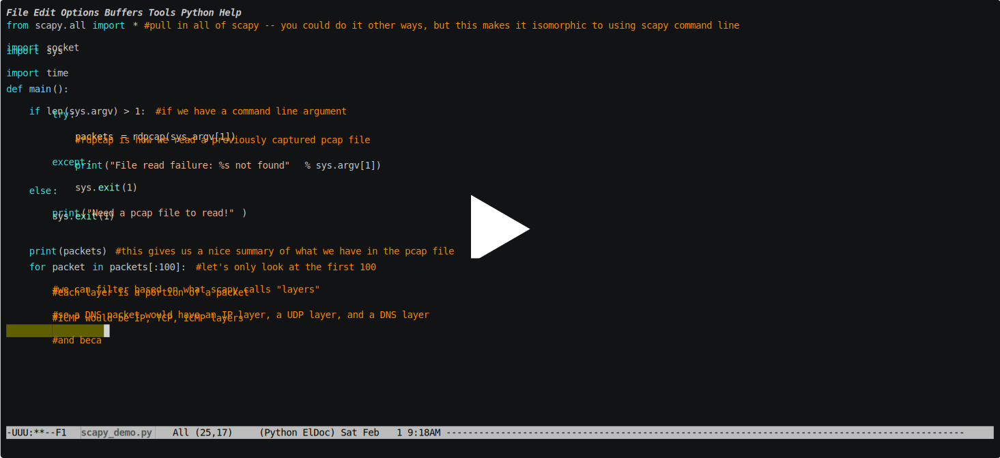

* auto-gen TOC:
{:toc}

## Introduction

Scapy is a python environment for packet processing. Commonly used as a fuzzing framework (more on that in Module 5), it can also be used as a pcap processing environment, which is what we use it for here.

From the official description:

    Scapy is a Python program that enables the user to send, sniff and dissect and forge network packets. This capability allows construction of tools that can probe, scan or attack networks.

There are two main modes of use: via the `scapy` command (which is `ipython` based), and directly within python. While the former is useful for interactive use, the latter lends itself well to scripting. When I'm working on a new `scapy` script, I will often use the `ipython` environment to quickly test layers, then move to writing a script when I have more of a sense of what I'm wanting. This shortens the test iteration cycle (for me).

Because of the power of `scapy`, and its use of raw sockets, root privileges are required for its use. As long as we are operating in the virtual environment, this isn't a problem. At this point, we aren't sending packets, and so don't have to worry about which interface, what that will do at the host network level, or interfering with the network on which the host is resident. 

I've mentioned that sometimes you can't use `nmap` due to the well known nature of it -- some networks and some devices filter `nmap` originated packets. In these cases, `scapy` comes to the rescue! We won't get to these specific details yet, but keep that in the back of your mind.

## Overview of scapy framework

One of the overarching themes of the `scapy` framework is that it does not apply any preconceptions to the data. In other words, rather than only storing one view of the data, it stores the raw data and allows you to adjust the viewpoint as you desire -- all without having to re-run any probe/capture actions. By requiring you, as the developer, to apply any viewpoints or interpretations, `scapy` allows for the creation of tools the developers had never even considered.

This lack of viewpoint is one of `scapy`'s greatest strengths. No imposition on the developer means no limitations on the tools one can develop. While this may seem frustrating at first (no viewpoint means very little built in convenience functions), as you gain more experience with `scapy` and network analysis in general you will find that you have built up a library of functionality that works for your situation. This means writing custom tools is straightforward, rather than having to manipulate the tool in ways for which it was never written.

### pcap file interface

For the purposes of this module, one of the most important parts of `scapy` is the `pcap` file interface. You can read or write `pcap` files directly via python function calls, allowing you capture how you like while processing in `scapy`, or even capture in `scapy` for later processing (via `scapy` or otherwise).

* pcap file reading

    [`rdpcap()`](https://scapy.readthedocs.io/en/latest/api/scapy.utils.html#scapy.utils.rdpcap): this is the primary way to interface with previously captured packets. It can read `pcap` files (as well as `pcapng` files) generated by `tcpdump`, `wireshark`, or even `tshark`.

    Simply give it the name and path of the `pcap` file you want to import, and it will create a ['PacketList'](https://scapy.readthedocs.io/en/latest/api/scapy.plist.html#scapy.plist.PacketList) object for you, which is iterable, printable, and has some pretty slick functionality (such as displaying a graph view of all conversations in the capture). I'd strongly suggest looking at the docs behind the link for more information.

* pcap file writing

    * [`sniff()`](https://scapy.readthedocs.io/en/latest/api/scapy.sendrecv.html#scapy.sendrecv.sniff): `sniff()` is a function that allows for extensive variety in packet capture. You can use it to replicate `tshark` or `tcpdump`, as well as arbitrary different tools for different purposes. Some specific aspects to call out here (see the link for more details and additional options):

        * `sniff` can apply a function to each packet (parameter `prn`) -- this can be defined inline as a lambda or externally and passed as a function parameter;
        * `sniff`, like `tcpdump` or `tshark`, takes a count (parameter `count`) which terminates capture after the specified number of packets are received;
        * parameter `filter` takes a BPF style filter (same as `wireshark`, `tcpdump`, and `tshark`) and only captures packets which match the filter;
        * parameter `timeout` terminates capture after a given time has passed;
        * parameter `iface` specifies the specific interface on which to capture.
        * asynchronous capture is also possible -- this is typically less performant, but allows you to programmatically start and stop capture. This could be useful if user interaction is the preferred way of starting/stopping capture.
    * [`wrpcap(filename.pcap)`](https://scapy.readthedocs.io/en/latest/api/scapy.utils.html#scapy.utils.wrpcap): once you have a `PacketList` (however you got it), you can write a `pcap` file via the `wrpcap()` function. This will store your into `filename.pcap`, which you can then use in your favorite packet flow inspection tool.

## Example usage for reading a pcap file
[](https://asciinema.org/a/Too7fd5qMW1V4qSGoL2BMqakM?speed=2)

## Example script developed above

```python
from scapy.all import * #pull in all of scapy -- you could do it other ways, but this makes it isomorphic to using scapy command line
import socket
import sys
import time

def main():
	if len(sys.argv) > 1: #if we have a command line argument
		try:
			packets = rdpcap(sys.argv[1])
			#rdpcap is how we read a previously captured pcap file
		except:
			print("File read failure: %s not found" % sys.argv[1])
			sys.exit(1)
	else:
		print("Need a pcap file to read!")
		sys.exit(1)

	print(packets) #this gives us a nice summary of what we have in the pcap file

	for packet in packets[:100]: #let's only look at the first 100
		#we can filter based on what scapy calls "layers"
		#each layer is a portion of a packet
		#so a DNS packet would have an IP layer, a UDP layer, and a DNS layer
		#ICMP would be IP, TCP, ICMP layers
		#and because we're on an ethernet network, all of the above also has an ether layer
		#let's not print DNS packets
		if not packet.haslayer(DNS):
			packet.show() #print the contents of the packet
			print(packet.summary()) #we also can print out a summary of the packet, similar to tcpdump default output
			time.sleep(0.2) #small pause between packets


if __name__ == '__main__':
	main()
```

## Additional Resources

* Scapy usage including reading/writing pcap files (in case you didn't click any of the other links in the page): [Scapy General Documentation](https://scapy.readthedocs.io/en/latest/usage.html)
* [SANS Scapy cheat sheet](https://www.sans.org/blog/sans-pen-test-cheat-sheet-scapy/) -- this is a great resource for scapy, and I'd suggest you keep it handy